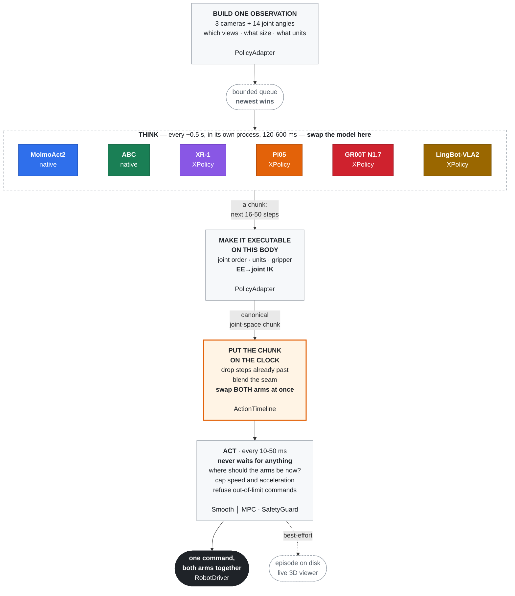

<div align="center">

# ManiMux

**Local asynchronous inference and execution infrastructure for real-robot VLAs.**

Models are replaceable; ManiMux owns the control loop, robot, safety, recording and viewer.

[](https://www.python.org/)
[](https://docs.astral.sh/ruff/)
[](https://mypy-lang.org/)
[](docs/molmoact-yam-runbook.md)
[](https://github.com/SII-LiuLab/manimux/commits)

[English](README.md) · [简体中文](README.zh-CN.md)

</div>


## ManiMux in 30 Seconds

**ManiMux is an asynchronous inference runtime between VLA policies and real robots.** The policy
decides what should happen next; ManiMux decides when and how to execute it smoothly and safely,
then records the complete run.

```text
cameras + robot state
        ↓
Policy / XPolicy model     predicts the next 16-50 action steps
        ↓
PolicyAdapter              converts them into executable robot joints
        ↓
ManiMux Runtime + Strategy schedules inference, trims stale actions and checks safety
        ↓
Robot                      submits both arms atomically on one control tick

Side outputs: Recorder episode + 3D Viewer
```

Remember three rules:

1. **The model never commands the robot directly.** It only returns a future action chunk.
2. **The adapter translates semantics.** Joint, EE-pose and delta outputs become one canonical chunk.
3. **ManiMux executes.** Control timing, Timeline, Safety and Recorder are not copied per model.

## Ten-Minute Hardware-Free Start

```bash
git clone --recursive https://github.com/SII-LiuLab/manimux.git
cd manimux
uv sync --dev
uv run manimux run --config configs/mock.yaml
```

`configs/mock.yaml` uses a fake robot, camera and policy while exercising the real worker,
Timeline, SmoothExecutor, SafetyGuard and Recorder. It runs `120` control ticks and writes one
episode under `data/`; it never touches a camera, CAN interface or physical arm.

Launch the independent YAM viewer demo:

```bash
uv run manimux-viewer --robot yam --demo --port 8086
```

Open `http://localhost:8086`. The `--demo` process is a standalone visualization demo, not a live
view of the mock runtime above.

### Try Three Safe Changes

Copy the config first so the repository baseline stays unchanged:

```bash
cp configs/mock.yaml /tmp/manimux-beginner.yaml
```

Change one field at a time and rerun:

| Change | Suggested value | What it demonstrates |
|---|---:|---|
| `run.max_steps` | `120 → 300` | Control ticks and the episode lifecycle |
| `policy.inference_delay_s` | `0.04 → 0.20` | The control loop does not block on a slower model |
| `execution.blend_steps` | `0 / 2 / 8` | The seam between consecutive action chunks |

Read the first config as seven blocks: `run` defines the experiment, `robot` the embodiment,
`sensors` the observation, `policy` the model and chunk, `execution` scheduling and commands,
`viewer` live display, and `recording` the recording policy (the current runtime always records).
See the
[field-by-field config tour](configs/README.md#第一份配置configsmockyaml).

## Where Beginners Should Look

| Path | Think of it as |
|---|---|
| `configs/` | Experiment entry points: model, embodiment, checkpoint and runtime |
| `docs/*-runbook.md` | Operating instructions for installing, starting, checking and stopping a model |
| `src/manimux/` | Shared engine: runtime, robot, sensor, safety, recording and viewer |
| `XPolicyLab/` | Model internals: adapters and samplers for Pi05, GR00T, XR-1 and LingBot |
| `data/` | Run output: resolved config, actions, states, events and episode result |

Running experiments normally requires only `configs/` and one runbook. Enter `src/manimux/` to
change shared infrastructure, and enter `XPolicyLab/` only for model preprocessing, flow denoising
or model-native RTC sampling.

## Purpose

VLA inference is commonly slower than a robot control period and returns actions in chunks.
ManiMux moves inference out of the control loop and owns replaceable inference strategies,
chunk scheduling, stale-prefix trimming,
atomic dual-arm commits, execution constraints, safety checks, recording and live visualization.

ManiMux is not tied to one model library. MolmoAct and ABC have native service adapters;
additional foundation models enter through `XPolicyLab/`. ManiMux keeps the stable runtime and
wire bridge. Model preprocessing, flow denoising and model-native RTC sampling stay in the
XPolicyLab adapter; embodiment mapping and execution safety stay in ManiMux.

## Architecture

Two loops at different speeds. The whole design is about the hand-off between them.



**The control loop never waits** — not for the model, disk, viewer, or a log line.
**A stale or invalid chunk never reaches the robot** — wrong session, old sequence,
past deadline, bad shape, non-finite value, or a dual-arm plan the two arms disagree
on drops the *whole* chunk with a logged reason.

The real-robot control loop exists only once. Its inference strategy is replaceable:
the default strategy refills when the Timeline runs low, while RTC derives a condition
and soft mask from real execution progress. XPolicy advertises sampler capabilities at
handshake time, so an RTC config fails before robot connection when the live model has no
`get_action_rtc` hook.

## Repository Layout

| Path | Responsibility |
|---|---|
| `src/manimux/runtime/` | One control loop plus pluggable inference strategies, Timeline, Smooth/MPC and Safety |
| `src/manimux/policies/` | `PolicyModel` / `PolicyAdapter` contracts and isolated worker |
| `src/manimux/integrations/` | Native integrations and the shared XPolicy WebSocket bridge |
| `src/manimux/robots/` | RobotDriver implementations; dual YAM is the current hardware target |
| `src/manimux/sensors/` | RealSense and the shared camera service |
| `src/manimux/recording/` | Episodes, Zarr, events and action lineage |
| `src/manimux/viewer/` | Generic viewer protocol and robot geometry adapters |
| `XPolicyLab/` | Submodule pointing to our XPolicyLab fork; model-internal changes live here |
| `checkpoints/pretrained/` | Unmodified foundation-model or upstream release weights |
| `checkpoints/finetuned/<publisher>/` | Fine-tuned checkpoints, named after their published repository |
| `configs/<model>/<embodiment>/` | One explicit configuration per model and embodiment experiment |
| `docs/*-runbook.md` | Per-model environment, checkpoint, contract and default startup |
| `docs/reproductions/` | Per-method equations, integration, commands, evidence and review records |

For example, the Robocurve YAM releases live at
`checkpoints/finetuned/robocurve/{pi05-yam-molmoact2,gr00t-n1.7-yam-molmoact2}`;
the official OpenPI `pi05_base` remains under `checkpoints/pretrained/`.

## Integrations

Status: ✅ running · 🧪 experimental · 🚧 not deployable yet · 🔌 infrastructure

| Status | Model/path | ManiMux canonical action | Config | Runbook |
|---|---|---|---|---|
| ✅ | MolmoAct2 + YAM | 30 × 14 joint positions | `configs/molmoact2/yam/` | [MolmoAct2](docs/molmoact-yam-runbook.md) |
| ✅ | ABC + YAM | 30 × 14 joint positions | `configs/abc/yam/` | [ABC](docs/abc-yam-runbook.md) |
| ✅ | OpenPI Pi05 + YAM | 16/50 × 14 absolute joint positions | `configs/pi05/yam/` | [Pi05](docs/pi05-yam-runbook.md) |
| ✅ | GR00T N1.7 + YAM | 16 × 14 absolute joint positions | `configs/groot/yam/` | [GR00T](docs/gr00t-yam-runbook.md) |
| ✅ | XR-1 + YAM | `30×60` EE delta → `30×14` joints | `configs/xiaomi-xr1/yam/` | [Runbook](docs/xiaomi-xr1-yam-runbook.md) |
| ✅ | LingBot-VLA2 + YAM | `50×14` joints; limited base capability | `configs/lingbot-vla2/yam/` | [Runbook](docs/lingbot-vla2-yam-runbook.md) |
| 🔌 | XPolicy bridge | Observation/action wire contract | `configs/xpolicylab/yam/` | [Runbook](docs/xpolicylab-runbook.md) |

OpenPI Pi05 has completed the real three-camera, YAM normalization, XPolicy model-server,
official 10-step flow sampling, default ManiMux and Pi-guided RTC paths on dual YAM. RTC ran with
measured `d=3-5` steps and no post-start chunk gap. The checkpoint produced task-related motion,
but remained hesitant in this scene and has no established success rate; that policy-quality
result is separate from the completed inference infrastructure. GR00T has also completed GPU,
XPolicy WebSocket, default ManiMux, three-camera, dual-YAM and Recorder execution; its failed pick
rollouts are policy-quality results. XPolicy XR-1 and LingBot-VLA2 have also completed their
default ManiMux hardware paths using `server/base.yaml` with the shared `infra/manimux.yaml`.
Here ✅ means GPU, XPolicy, cameras, scheduling, dual-arm execution and Recorder are connected;
it does not establish YAM task success for a base checkpoint, and projection statistics are not
evidence of YAM post-training.

The local `pi05_base`-initialized red-ball fine-tune at step 1000 has a separate 50-step contract,
checkpoint-matched `yam_pick_red_ball_box_v1` stats, and verified offline GPU, XPolicy WebSocket,
three-camera, ManiMux and dual-YAM execution. It reproduces the low-quality 20-episode demonstration
trajectory but does not yet complete the task reliably; this is a policy-quality result, not an
infrastructure gap.

XR-1 has completed a real 5B GPU forward, XPolicy WebSocket, ManiMux, camera,
dual-YAM and Recorder end-to-end startup, confirming that the robot executed
model output. In the first base rollout the right arm was comparatively normal
while the left arm made persistently abnormal large motions. The infrastructure
path is therefore connected, but the YAM action-semantics gate remains failed;
this was neither startup-pose motion nor evidence of YAM zero-shot capability.

## Inference Algorithm Roadmap

Status: ✅ hardware exercised · 🧪 integrated and offline verified · 🚧 integrating · 📋 planned ·
👀 tracked but training-dependent. Completion means the method path has run on hardware; it does not
mean that every policy succeeds at the task or that every method performs well. All methods in the
main list run from an existing checkpoint without user retraining.

| Status | Algorithm | Integration layer | Current evidence | Method documentation | Upstream |
|---|---|---|---|---|---|
| ✅ | Default (ManiMux asynchronous chunk execution) | Runtime | Exercised across the current dual-YAM model integrations | [Architecture](docs/architecture.md) | This repository |
| ✅ | RTC (inference-time Pi-guided) | Flow sampler + Runtime | Pi05/YAM hardware; measured `d=3–5`, no post-start chunk gap | [XPolicy RTC contract](docs/xpolicylab-runbook.md#rtc-规则) | [Paper](https://arxiv.org/abs/2506.07339) · [Kinetix code](https://github.com/Physical-Intelligence/real-time-chunking-kinetix) |
| ✅ | ACT Temporal Ensembling | Runtime | Pi05 step-1000/YAM hardware; operator observed smooth continuous execution | [Method](docs/act-temporal-ensemble.md) | [Pinned ACT source](https://github.com/tonyzhaozh/act/blob/742c753c0d4a5d87076c8f69e5628c79a8cc5488/imitate_episodes.py#L191-L259) · [LeRobot](https://github.com/huggingface/lerobot) |
| ✅ | Adaptive Action Chunking (AAC) | Pi05/GR00T multi-sample + Runtime | Pi05 step-1000/YAM hardware; functional but visibly pauses at roughly `0.51 s` warmed latency | [Core audit](docs/reproductions/aac.md) · [Pi05 audit](docs/reproductions/aac-pi05.md) | [GR00T server](https://github.com/Adaptive-Action-Chunking/gr00t-multi-sample/tree/11e926b0f34cf6acfcb92c0fe6127a1bdc7b856a) · [official selector](https://github.com/Adaptive-Action-Chunking/robocasa/blob/fed3e6b5eb348160dd0570f326f726758fee9056/robocasa/demos/action_optimization/action_entropy_v2.py) |
| ✅ | PAINT paper reproduction | Pi05 flow sampler + Runtime | Pi05 step-1000/YAM hardware; operator observed markedly improved continuity | [Pi05 audit and commands](docs/reproductions/paint-pi05.md) | [Paper](https://arxiv.org/abs/2606.19774) · [official repository](https://github.com/htrbao/paint-action-chunking) currently contains documentation only |
| ✅ | AutoHorizon JAX port | Pi05 action-expert introspection + synchronous Runtime | Pi05/YAM hardware exercised; faithful synchronous cadence caused visible inference holds | [Pi05 audit and commands](docs/reproductions/autohorizon-pi05.md) | [Code](https://github.com/hatchetProject/AutoHorizon/tree/c7504f1756109103f2cfcc2e23f1b1a23841c885) |
| 📋 | SGAC | Diffusion-policy sampler + Runtime | Official release targets low-dimensional Diffusion Policy; a Pi05 flow port would be a non-official extension | — | [Code](https://github.com/junhyukso/SGAC/tree/b885b0acfca214c30a65e1ae24323d3b98c82e76) |
| ✅ | DVAC paper reproduction | Pi05 flow sampler + Runtime | Pi05/YAM hardware exercised; trajectory judged more accurate than the preceding method, with synchronous pauses | [Pi05 audit](docs/reproductions/dvac-pi05.md) | [Paper](https://arxiv.org/abs/2606.03847) · official code not located |
| 📋 | ProbeFlow | Flow solver acceleration | Denoising velocity probes | — | [Paper](https://arxiv.org/abs/2603.17850) · official code not located |
| 📋 | DiscreteRTC | Discrete-diffusion sampler | Requires a compatible pretrained masked-token policy | — | [Code](https://github.com/outsider86/DiscreteRTC) · [StarVLA](https://github.com/starVLA/starVLA) |

The training-free catalog now converges around the completed methods above. Additional methods remain optional rather than blocking the first comparison suite. Runtime-only methods stay in ManiMux. Denoising, inverse-flow,
attention and multi-sample hooks stay beside the official model implementation in XPolicy; they are
not reimplemented inside the robot control loop.

AAC is the first explicit embodiment adaptation in this catalog. The official implementation targets
**GR00T N1.5 with 16-step, 7D end-effector position/rotation/gripper actions** in its RoboCasa/LIBERO
clients. Our current integration keeps its shared-backbone `N=20` sampling, Gaussian/Bernoulli entropy,
entropy elbow, motion floor, and candidate selectors. The YAM checkpoint still outputs
**14D absolute joints**, but every candidate is converted by the shared YAM FK into per-step EE
position/rotation increments plus gripper. Entropy and selectors use fixed min-max stats computed from
the matching YAM data domain; motion uses unnormalized EE increments. The official single-arm score is
evaluated independently for each arm and the two scalar scores are averaged. The remaining embodiment
differences are GR00T N1.7/Pi05, dual-arm averaging, and a YAM-calibrated physical motion threshold.
GR00T and Pi05 expose isolated multi-sample hooks; their normal inference, RTC and ACT paths stay
unchanged. The selected original joint values execute unchanged; this is not a claim that the paper
evaluated Pi05 or YAM.

Current Pi05/YAM AAC is **functional but visibly laggy on hardware**. On the local RTX 4090, the
first JAX request compiled in about `7.0 s`; warmed `N=20` requests remained about `0.51 s`. AAC uses
the official synchronous cadence, so after each selected chunk the robot holds while the next
candidate batch is generated. The operator observed this pause as obvious stop-and-go motion. Treat
AAC as an integrated experimental baseline, not a responsive real-time runtime; lowering executor
speed does not remove the sampler stall.
See [`docs/aac.md`](docs/aac.md).
The source-by-source reproduction audit is in
[`docs/reproductions/aac.md`](docs/reproductions/aac.md).

PAINT is implemented from Algorithm 1 and the numerical-analysis appendices of the paper because its
official repository does not yet publish source code. For Pi05, XPolicy performs the paper's naive
forward pass, backward-Euler inversion, prefix-only noise repainting and final unmodified forward pass.
ManiMux supplies only the asynchronous execution index `s`, rolling delay forecast `d`, and the exact
old-chunk prefix `A[s:s+d]`. The implementation is therefore labelled a **paper reproduction**, not an
official-code port, until upstream code can be compared. See
[`docs/reproductions/paint-pi05.md`](docs/reproductions/paint-pi05.md).
The first real Pi05 PAINT GPU probe returned a finite `50 x 14` joint chunk and declared backward
Euler with `30` velocity evaluations; its `6087.2 ms` round trip was the first-call JAX compilation,
not a steady-state latency measurement. The same configuration subsequently completed a dual-YAM
hardware rollout. The operator reported very good motion continuity compared with the preceding
baselines; this is positive hardware evidence, not yet a measured task-success or statistical claim.

### Upstream Fidelity and No-Retraining Rule

- When official inference code exists, ManiMux ports the smallest possible upstream core, records the
  source repository and revision, and keeps its equations, sampling order and default parameters intact.
- ManiMux adds only the XPolicy wire contract, capability handshake, scheduling, canonical action
  conversion, recording and robot execution around that core. It does not silently replace the paper's
  sampler with a visually similar smoother.
- When no official implementation is public, the row remains explicitly labelled a paper reproduction
  until parity tests against an upstream release become possible.
- The main catalog must run from an existing policy checkpoint without training by the ManiMux user.
  An auxiliary module is eligible only when its authors publish compatible pretrained weights. Methods
  that require us or the user to train a corrector, adapter or modified policy remain tracked separately.

| Status | Training-dependent method | Why it is not in the main catalog yet | Upstream |
|---|---|---|---|
| 👀 | TT-RTC / Soft RTC | Requires delay-aware policy training | [Soft RTC paper](https://arxiv.org/abs/2605.25537) |
| 👀 | VLASH | Published results require temporal-offset fine-tuning | [Code](https://github.com/mit-han-lab/vlash) |
| 👀 | REMAC | Requires masked-action LoRA fine-tuning | [Code](https://github.com/hatchetProject/REMAC) |
| 👀 | A2C2 | Requires a learned residual correction model | [LIBERO](https://github.com/k1000dai/a2c2-libero) · [Kinetix](https://github.com/k1000dai/a2c2-kinetix) |
| 👀 | FutureRTC | Trains state/observation prediction modules | [Code](https://github.com/JianghaiSCU/FutureRTC) |
| 👀 | VLA-Corrector | Freezes the VLA but trains an external latent corrector | [Code](https://github.com/ZJU-OmniAI/vla-corrector) |
| 👀 | DCDP | Freezes the base policy but trains its dynamic correction module | [Code](https://github.com/wupengyuan/dcdp) |
| 👀 | Pi-R2 | Requires fine-tuning the flow policy for its reactive schedule | [Code](https://github.com/pi-r2-flow/pi-r2-flow) |

The comparison implementation in
[TheAyos/async-vla-inference](https://github.com/TheAyos/async-vla-inference) is a useful reference for
IT-RTC, TT-RTC, VLASH and A2C2, but each ManiMux integration still traces its algorithm core to the
original method repository rather than treating the comparison fork as the source of truth.

## From Mock to Real Models

Update submodules in an existing checkout:

```bash
git submodule update --init --recursive
```

The core development environment uses `./.venv`, the YAM runtime uses `envs/yam/.venv`, and model
servers use isolated environments. Follow [the environment guide](envs/README.md) and one model
runbook for CUDA, Torch, checkpoints and first startup; do not assemble a hardware command from
README snippets.

### Shared YAM Services

The camera service and viewer are model-independent and start once per experiment stack:

```bash
envs/yam/.venv/bin/manimux-camera-server --config configs/cameras.yaml
envs/yam/.venv/bin/manimux-viewer --robot yam --host 0.0.0.0 --port 8086
```

### Native Example: MolmoAct2

```bash
envs/yam/.venv/bin/manimux-molmoact-server --host 127.0.0.1 --port 8202
envs/yam/.venv/bin/manimux run --config configs/molmoact2/yam/infra/manimux.yaml
```

### XPolicy Example: Pi05-YAM

```bash
XPolicyLab/policy/Pi_05/openpi/.venv/bin/python \
  scripts/pi05_yam_server.py \
  --config configs/pi05/yam/server/finetune.yaml

envs/yam/.venv/bin/manimux run --config configs/pi05/yam/infra/manimux.yaml
```

These snippets show entry points only. They do not replace checkpoint validation, preflight,
CAN checks or shutdown procedures. Model setup stays in its runbook; ACT, AAC, PAINT and later
strategy commands stay in the linked method documentation in the algorithm list.

## Configuration Convention

```text
configs/
  <model>/
    <embodiment>/
      server/              # model-service configs
        <checkpoint>.yaml
      infra/               # ManiMux robot, sensors, execution and recording
        <experiment>.yaml
  cameras.yaml
  robots/
  mock.yaml
```

One experiment uses one explicit config. Different checkpoints, runtimes and embodiments do not
share hidden switches. See [configs/README.md](configs/README.md) for naming rules.

## Adding a Model or Embodiment

| Boundary | Responsibility |
|---|---|
| `PolicyModel` | Call a local model or model service; never touch the robot |
| `PolicyAdapter` | Camera/state encoding, action decoding, normalization, joint mapping and FK/IK |
| `RobotDriver` | Vendor SDK, state, commands, home, stop and close |
| `SensorDriver` | Read named, timestamped sensor streams |
| `RobotAdapter` | Viewer URDF, FK, joint groups and appearance |

Changing a model only changes the two Policy layers. Changing a robot only changes the embodiment
adapter, driver and config. Runtime, Timeline, Safety, Recorder and the viewer protocol are not
copied per model. See [Architecture](docs/architecture.md) for the complete contracts.

## Documentation

- [Program progress](docs/program-progress.md)
- [XPolicyLab integration](docs/xpolicylab-runbook.md)
- [MolmoAct2](docs/molmoact-yam-runbook.md) · [ABC](docs/abc-yam-runbook.md)
- [Pi05](docs/pi05-yam-runbook.md) · [GR00T](docs/gr00t-yam-runbook.md) · [XPolicy XR-1](docs/xiaomi-xr1-yam-runbook.md)
- [LingBot-VLA2](docs/lingbot-vla2-yam-runbook.md) · [CAN bus](docs/can-bus.md)
- [Architecture](docs/architecture.md) · [Development conventions](AGENT.md)

## Safety

ManiMux drives physical robots. Passing tests does not prove hardware safety, and software cannot
replace a physical emergency stop, hardware limits or the vendor watchdog. The runtime starts
paused, faults do not auto-recover, and every hardware entry point requires its runbook preflight.

## License

See [THIRD_PARTY_NOTICES.md](THIRD_PARTY_NOTICES.md) and [`licenses/`](licenses) for upstream
attribution.
