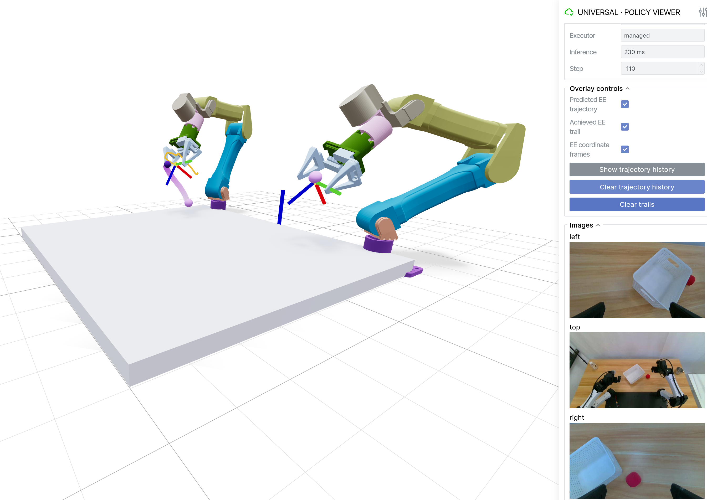

<div align="center">

# ManiMux

**面向双臂操作的本地异步策略运行时。**

让 VLA 在真机上跑起来，而控制环一次都不用等它。

[](https://www.python.org/)
[](https://docs.astral.sh/ruff/)
[](https://mypy-lang.org/)

[English](README.md) · [简体中文](README.zh-CN.md)

</div>

<!-- 📷 截图 —— assets/viewer-hero.png
     真机 rollout 进行中的 viewer 全景：双臂模型、紫色渐变的预测末端轨迹、
     相机面板，以及显示 Policy / Chunk / Inference 的 GUI 侧栏。
     浏览器全屏，宽度约 1600px。 -->



## 为什么

现在的策略又慢又成块：一次 VLA 推理要 120–600 ms 才吐出 30 步未来动作，而控制器需要
每 10–50 ms 就有一条新命令。直接拼在一起，只会得到两种失败：等推理时机械臂卡顿，
或者新采样的 chunk 与执行到一半的旧 chunk 不一致，接缝处跳变。

ManiMux 就是中间那一层。推理被挡在控制环之外；每个 chunk 经过时间对齐、裁掉已过去的
前缀，并**在双臂之间原子切换**；结果变成受速度约束的关节命令、落盘的完整动作血缘，
以及一个能在策略动手**之前**看到它意图的实时 3D 视图。

一切都在本地 —— 一次运行一个 YAML，一个 episode 一个目录。没有云端推理、gateway、
控制面或数据库。

## 数据流

```text
camera-server ──► SensorDriver ──► Observation ──► 有界 latest-wins 队列
                                                            │
policy-server ◄── PolicyModel ◄─────────────────────────────┘
      │
      └─► 原始 chunk ─► PolicyAdapter ─► ActionTimeline ─► Smooth│MPC ─► Safety
                        校验·IK·映射      原子替换                │
                                                                 ▼
                                                     RobotDriver.send_command()
                                                                 │
                                       Recorder ◄── 尽力而为旁路 ─┴─► Viewer
```

**控制环永不等待** —— 不等模型、磁盘、viewer，也不等一行日志。**过期或非法的 chunk
绝不会到达机器人** —— session 不符、sequence 过旧、超过 deadline、维度错误、含非有限值、
左右臂 plan id 不一致，都会**整块**丢弃并写一条 reason event。

## 项目组成

| 模块 | 路径 | 作用 |
|---|---|---|
| Runtime | `runtime/edge.py` | 定频控制环、observation 构建、watchdog、安全状态机 |
| Timeline | `runtime/timeline.py` | 时间索引的 chunk 存储：过期前缀裁剪、blend 窗口、双臂原子提交 |
| 执行器 | `runtime/executors/` | `smooth`（重采样 + 低通 + 限幅）和关节空间局部 `mpc` |
| RTC runtime | `runtime/rtc/` | [Real-Time Chunking](https://arxiv.org/abs/2506.07339) 作为并列 runtime —— 用 inpainting 式引导缝合 chunk，而非下游滤波 |
| 机器人 | `robots/` | `RobotDriver` 契约 · `mock` · ManiUniCon/Meshcat · CAN 双 **YAM**，含不运动的 `shadow` 模式 |
| 传感器 | `sensors/` | `SensorDriver` 契约 · `mock` · RealSense · 所有策略共用的独立 ZMQ **相机服务** |
| 策略 | `policies/` | `PolicyModel`（只做推理）+ `PolicyAdapter`（全部本体语义）、有界 worker 队列 |
| 运动学 | `kinematics/` | 可复用 FK/IK，让末端空间策略在 adapter 里变成关节 chunk，而不是在 runtime 里 |
| 记录 | `recording/` | Zarr + JSONL + MP4，原子收尾前一直是 `.partial` |
| Viewer | `viewer/` | Viser 面板、机器人无关的 ZMQ 协议、`RobotAdapter` 几何边界 |
| 集成 | `integrations/` | MolmoAct2 · ABC · XR-1 的模型服务与 adapter |

三个策略开箱可用，且共用**同一套**机器人层、相机层和 viewer 层：

| 策略 | 参数量 | 动作空间 | chunk | 延迟 | 配置 |
|---|---|---|---|---|---|
| [MolmoAct2](https://huggingface.co/allenai/MolmoAct2-BimanualYAM) | — | 关节位置 | 30 × 14 | ~240 ms | `configs/molmoact-yam-live.yaml` |
| ABC-DiT XL | 2.02 B | 关节位置 | 30 × 14 | ~170 ms | `configs/abc-yam-live.yaml` |
| 小米 XR-1 | 5.5 B | 末端增量 → IK | 30 × 60 | ~121 ms | `configs/xr1-yam-live.yaml` |

## 安装

```bash
git clone https://github.com/SII-LiuLab/manimux.git && cd manimux
uv sync --dev            # 核心 runtime + mock 栈 + viewer，装到 ./.venv
```

三个策略各自验证过的 torch 构建互不兼容（cu121 / cu128 / cu126），所以每套硬件栈在
`envs/` 下有独立 venv。以 MolmoAct 为例：

```bash
uv venv envs/yam/.venv --python 3.12
uv pip install --python envs/yam/.venv/bin/python -e ".[molmoact-yam]"
uv pip install --python envs/yam/.venv/bin/python \
  "git+https://github.com/i2rt-robotics/i2rt.git@5d47b358bafb30c65e397f2ece506550a0db4594"
```

`i2rt` 是厂商 CAN 驱动，单独 pin 是因为它不属于 ManiMux 代码。`envs/abc` 和
`envs/xr1` 用同样的方式建立，只是要先装各自的 torch；`abc-yam` 和 `xr1-yam` 两个
extra 有意不含 `torch`。

各环境的分工 —— `envs/*` 是手工管理的，必须留在 `uv sync` 之外，否则其中未声明的
`i2rt` / `torch` 会被卸掉：

| venv | 用途 |
|---|---|
| `./.venv` | uv 托管：`make` 目标、mock 运行、viewer demo。只有 core + dev |
| `envs/yam` | **一切真机进程** —— MolmoAct 服务、相机服务、viewer、runtime |
| `envs/abc` · `envs/xr1` | 只跑各自的模型服务；runtime 仍然从 `envs/yam` 起 |

## 快速开始 —— 无需硬件

```bash
uv run manimux run --config configs/mock.yaml           # 全 mock 的完整异步闭环
uv run manimux run --config configs/mock.yaml --executor mpc
uv run manimux-viewer --robot yam --demo --port 8086    # 用合成轨迹跑 viewer
```

## 真机推理

> ⚠️ 清空工作区，急停拿在手上，并确认 `can_left` / `can_right` 都是 `ERROR-ACTIVE`
> （见 [docs/can-bus.md](docs/can-bus.md)）。

以 MolmoAct2 + 双 YAM 为例。四个进程要开**四个独立终端** —— 每个都在前台常驻，
不能粘进同一个 shell。四者全部来自同一个 `envs/yam` 环境。

**1 · 模型服务。** MolmoAct 上 GPU；每个策略有自己的服务程序
（`manimux-{molmoact,abc,xr1}-server`）。等到 `Warmup OK`。

```bash
envs/yam/.venv/bin/manimux-molmoact-server --host 127.0.0.1 --port 8202
```

**2 · 相机服务。** 独占 RealSense，与策略无关。等到 `REP bound`。

```bash
envs/yam/.venv/bin/manimux-camera-server --config configs/cameras.yaml
```

**3 · Viewer。** 同样与策略无关，然后打开 http://localhost:8086。

```bash
envs/yam/.venv/bin/manimux-viewer --robot yam --host 0.0.0.0 --port 8086
```

**4 · Runtime。** 唯一会打开 CAN 的进程 —— 但它仍然需要终端 1、2 处于运行状态。
先用 shadow 配置：不开 CAN、机械臂不动，但 viewer 里显示的就是它将要下发的那条轨迹。

```bash
envs/yam/.venv/bin/manimux run --config configs/molmoact-yam.yaml
```

确认轨迹合理后，再换成 live 配置。**这一条会让机械臂动起来。**

```bash
envs/yam/.venv/bin/manimux run --config configs/molmoact-yam-live.yaml
```

机械臂先移动到起始姿态，跑完 rollout，按 `Ctrl-C` 或达到 `run.max_steps` 后自动回零。
速度和时序全在配置里 —— `policy.action_dt_s`、`execution.smooth.max_velocity` /
`max_acceleration`、`execution.refill_threshold_s`、`robot.options.*_duration_s`。
改跑 ABC、XR-1 或 RTC 时，只需换掉终端 1 的模型服务和终端 4 的配置，终端 2、3
不用重启 —— 见下方运行手册。

Episode 写在 `data/<run-id>/<episode-id>/`，包含 `data.zarr` + `events.jsonl` +
`videos/*.mp4` + `result.json`，五个时间对齐的阶段始终存在：

```text
raw_model_action → scheduled_action → optimized_action → command_sent → measured_state
```

## 接入新本体和新模型

四个很小的 `Protocol`，其余部分都不用改。配置里用内置名、entry point 或
`module:factory` 指定插件，launcher 在启动时自检并快速失败。

| 边界 | 需实现 | 负责什么 | 参考 |
|---|---|---|---|
| `RobotDriver` | `connect · get_state · send_command · home · stop · close` | 厂商 SDK、CAN、命名 group（`left_arm`…）、关节顺序与单位 —— 外加一个 `shadow` 模式 | `robots/yam/` |
| `SensorDriver` | `start · read · close` | 带时间戳的帧；一次连接可发布多路命名流 | `sensors/camera_server/` |
| `PolicyModel` | `reset · infer · close` | 只做推理 —— 不碰机器人，通常是连到独立 venv 的瘦 HTTP 客户端 | `integrations/*/policy_plugin.py` |
| `PolicyAdapter` | `build_observation · decode_action · validate` | **全部**模型×本体语义：相机映射、归一化、group 顺序、末端→关节 IK、夹爪约定、维度与有限值校验 | `integrations/*/policy_plugin.py` |
| `RobotAdapter`（viewer） | `split_actions · pose · visual_configuration · …` | URDF、FK、配色 —— 面板本身保持机器人无关 | `viewer/robots/yam.py` |

Timeline 只接受 canonical 的 `joint_position` chunk。末端空间的策略应在 adapter 里用
`manimux.kinematics` 转换（XR-1 就是这么做的），于是换机械臂只需要改
`policy.options.kinematics`，模型服务端根本不知道有机器人这回事。

上机顺序不可跳步：**mock → shadow → 低速真机**，中间补上 adapter 的维度、单位、
关节顺序和 NaN/Inf 拒绝的单测。细节见 [docs/plugin-runtime.md](docs/plugin-runtime.md)。

## 文档

[架构](docs/architecture.md) ·
[插件运行时](docs/plugin-runtime.md) ·
[RTC](docs/rtc-runtime.md) ·
[MolmoAct 手册](docs/molmoact-yam-runbook.md) ·
[ABC 手册](docs/abc-yam-runbook.md) ·
[XR-1 手册](docs/xr1-yam-runbook.md) ·
[CAN 总线](docs/can-bus.md) ·
[开发约定](AGENT.md)

```bash
make format lint typecheck test test-integration mock-run
```

所有测试都不碰真机、GPU 和外网；只能在真机上跑的测试放在 `tests/hardware/`，不进 CI。

## 安全

ManiMux 会驱动真实机械臂，测试全绿**不代表**硬件安全。Runtime 启动后默认 **PAUSED**，
必须收到新鲜的 operator start 才会执行。Fault 绝不自动恢复，任一臂 fault 会使整个双臂
机器人 fault。ManiMux 不屏蔽厂商急停、限位和 watchdog —— 物理急停不经过软件。

## 许可

上游组件的归属见 [THIRD_PARTY_NOTICES.md](THIRD_PARTY_NOTICES.md) 和
[`licenses/`](licenses)：MolmoAct2（Apache-2.0）、i2rt YAM 资产（MIT）、CLIP（MIT）
与 DINOv3、Xiaomi-Robotics-1（Apache-2.0）。设计思想借鉴自 ManiUniCon 的 HAL、
Real-Time Chunking，以及 Universal Viewer 的 `RobotAdapter`。
